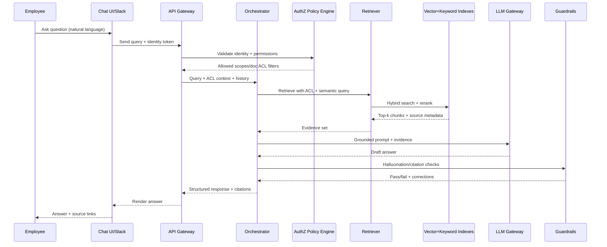

# AI Internal Knowledge Assistant — System Design

## 1) System Architecture Design

### High-level architecture

```mermaid
flowchart LR
    U[Employees: Web Chat / Slack / Dashboard] --> G[API Gateway]
    G --> A[AuthN/AuthZ Service\n(SSO + RBAC/ABAC)]
    G --> O[Orchestrator Service]

    O --> R[Retriever Service]
    O --> LLM[LLM Gateway\n(primary/fallback models)]
    O --> C[Conversation Memory]
    O --> OBS[Observability + Evaluation]

    R --> VDB[(Vector DB)]
    R --> KIDX[(Keyword/Metadata Index)]
    R --> ACL[(Permissions Index)]

    DS[Internal Data Sources\nDocs/Wikis/Transcripts/DB Dashboards] --> ING[Ingestion Pipeline]
    ING --> PARSE[Parsing + OCR + Normalization]
    PARSE --> CH[Chunking + Metadata]
    CH --> EMB[Embedding Service]
    EMB --> VDB
    CH --> KIDX
    CH --> ACL

    O --> RES[Response Composer\n(citations + structure)]
    RES --> U
```

### Core components

- **Client channels:** company chat UI, Slack bot, internal dashboard widget.
- **Gateway/API layer:** request validation, rate limiting, tenant routing.
- **Identity & access control:** SSO (Okta/Azure AD), RBAC/ABAC enforcement at retrieval time.
- **Orchestrator:** handles conversation state, query planning, retrieval strategy, and tool calls.
- **Retriever:** hybrid retrieval (semantic + keyword + metadata filters) with re-ranking.
- **LLM gateway:** model abstraction with fallback policy, prompt templates, output schemas.
- **Ingestion pipeline:** connector-based ETL from source systems into searchable indexes.
- **Storage/indexing:** vector DB + keyword index + document metadata store.
- **Observability/evals:** logging, tracing, hallucination checks, retrieval quality metrics.

### Recommended modular stack (example)

- **LLM APIs:** OpenAI / Anthropic / Azure OpenAI (through a gateway abstraction).
- **Vector DB:** Pinecone, Weaviate, Qdrant, or pgvector.
- **Search:** OpenSearch/Elasticsearch for keyword and filter search.
- **Document processing:** Unstructured, Tika, OCR (Textract/Document AI).
- **Workflow orchestration:** Airflow/Prefect/Temporal for scheduled indexing.
- **App layer:** Python (FastAPI) or Node (NestJS) microservices.
- **Auth:** OIDC/SAML SSO + policy engine (OPA/Cedar).
- **Telemetry:** OpenTelemetry + Prometheus/Grafana + centralized logs.

---

## 2) AI Agent Workflow Diagram



### Runtime answer policy

1. **Retrieve first, generate second** (no direct “freeform only” answering for enterprise queries).
2. **Cite every factual claim** with doc title, section/chunk, timestamp/version.
3. **Permission-aware retrieval** (never retrieve unauthorized chunks).
4. **Low-confidence behavior:** answer with uncertainty + suggest next best sources.

---

## 3) Knowledge Ingestion Pipeline

### Pipeline stages

1. **Connectors**
   - Google Drive, SharePoint, Confluence, Notion, Slack exports, LMS, BI exports, S3.
2. **Change detection**
   - Event-driven webhooks + nightly backfill to catch missed updates.
3. **Parsing/normalization**
   - PDF/Word/Sheets/Docs/transcripts extraction, OCR for scanned docs.
4. **Document enrichment**
   - Metadata: owner, department, confidentiality, effective date, version, tags.
5. **Chunking strategy**
   - 300–800 token chunks, overlap 10–20%, preserve headings/tables context.
6. **Embedding and indexing**
   - Generate embeddings, write to vector index, keyword index, and metadata store.
7. **ACL propagation**
   - Apply source permissions to each chunk; maintain user/group mappings.
8. **Quality checks**
   - Empty text detection, parser errors, stale index alerts, duplicate reduction.
9. **Scheduling**
   - Real-time for critical sources + daily/weekly periodic indexing.

### Pseudocode (ingestion)

```text
for source in configured_sources:
  docs = source.fetch_changes(since=last_checkpoint)
  for doc in docs:
    text, assets = parse(doc)
    chunks = chunk(text, strategy="semantic+heading")
    metadata = enrich(doc, owner, sensitivity, version)
    acl = fetch_acl(doc)
    vectors = embed(chunks)
    upsert(vector_db, chunks, vectors, metadata, acl)
    upsert(keyword_index, chunks, metadata, acl)
  checkpoint(source)
```

---

## 4) Example Prompts and Queries

### End-user query examples

- “What is our pricing model for enterprise customers?”
- “Summarize the latest research report in 5 bullets.”
- “Where is the PTO policy and what changed this year?”
- “What is the onboarding process for new clients in EMEA?”

### System prompt (assistant behavior)

```text
You are the company’s Internal Knowledge Assistant.
Use only retrieved internal evidence to answer factual questions.
If evidence is missing or conflicting, say so clearly.
Always return:
1) direct answer,
2) key supporting details,
3) citations with source title + section/chunk.
Respect user access scope and never reveal restricted content.
```

### Retrieval prompt template (orchestrator to retriever)

```text
User question: {query}
Conversation context: {history_summary}
User scopes: {scopes}
Filters: department={dept}, region={region}, confidentiality<={clearance}
Return top {k} chunks with diversity across sources and recency boost.
```

### Structured response schema (JSON)

```json
{
  "answer": "string",
  "supporting_points": ["string"],
  "citations": [
    {
      "source_title": "string",
      "source_uri": "string",
      "section": "string",
      "chunk_id": "string",
      "last_updated": "ISO-8601"
    }
  ],
  "confidence": 0.0,
  "follow_ups": ["string"]
}
```

---

## 5) Deployment Plan

### Phase 0 — Foundation (1–2 weeks)

- Define data sources, security classifications, and access model.
- Set SSO integration and baseline audit logging.
- Select stack (LLM, vector DB, search, orchestration).

### Phase 1 — MVP (3–5 weeks)

- Build ingestion for top 2–3 sources (e.g., policy docs + wiki + reports).
- Implement hybrid retrieval with ACL filtering.
- Deploy chat UI + Slack bot.
- Add citations and confidence scoring.

### Phase 2 — Reliability & Governance (2–4 weeks)

- Add hallucination checks, answer validation, and fallback behavior.
- Introduce evaluation harness (golden Q/A sets, retrieval precision@k, groundedness).
- Add PII/redaction guardrails and policy enforcement.

### Phase 3 — Scale-out (ongoing)

- Add more connectors and domain agents (HR, finance, legal, research).
- Introduce multi-step workflows (e.g., “compare policy versions”).
- Optimize cost/performance with caching and model routing.

### Infrastructure and ops checklist

- **Security:** encryption in transit/at rest, secret manager, private networking.
- **Compliance:** audit trails, retention policies, data residency controls.
- **SRE:** autoscaling, retries, dead-letter queues, SLA/SLO dashboards.
- **Disaster recovery:** backups and index re-build playbooks.

---

## Monitoring, Reliability, and Success Metrics

### Monitoring

- Query latency (p50/p95), retrieval latency, token usage/cost.
- Retrieval quality: precision@k, MRR, source diversity.
- Generation quality: groundedness score, citation coverage, refusal correctness.

### Hallucination reduction controls

- Enforce “answer only from retrieved evidence” mode.
- Require minimum citation coverage threshold.
- If below threshold: return “insufficient evidence” and ask clarifying question.

### Success metrics

- **Response accuracy** (human-rated grounded answers).
- **Adoption** (WAU/MAU, repeat usage).
- **Operational impact** (reduced internal support tickets).
- **Productivity gain** (time-to-answer reduction).

---

## Extension Path (Spec Research-style evolution)

The same platform can evolve into:

- **AI research analyst:** thematic synthesis across reports/transcripts.
- **Investment knowledge assistant:** deal memo search + thesis comparison.
- **Financial intelligence engine:** entity/event extraction + KPI trend Q&A.

This is enabled by adding domain-specific tools (SQL connectors, financial parsers, model-based table reasoning) to the same orchestrator and retrieval foundation.
